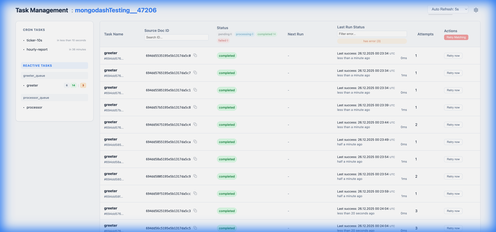

<br>


A modern JavaScript & Typescript MongoDB-based utility library. Includes [**Reactive Tasks**](https://vaclavobornik.github.io/mongodash/reactive-tasks), [**Cron Tasks**](https://vaclavobornik.github.io/mongodash/cron-tasks), [**Distributed Locks**](https://vaclavobornik.github.io/mongodash/with-lock), [**Transactions**](https://vaclavobornik.github.io/mongodash/with-transaction), and a [**Dashboard**](https://vaclavobornik.github.io/mongodash/dashboard).

[](https://coveralls.io/github/VaclavObornik/mongodash?branch=master)


See full documentation [here](https://vaclavobornik.github.io/mongodash/getting-started)

---

<br>

Installation:
```bash
npm install mongodash
```

Initialization
```typescript
import mongodash from 'mongodash';

await mongodash.init({
    uri: 'mongodb://mongodb0.example.com:27017/myDatabase' 
});
```
See more initialization options [here](https://vaclavobornik.github.io/mongodash/initialization).

<br>

## Reactive Tasks

```typescript
import { reactiveTask } from 'mongodash';

// Trigger a task when a user is updated
await reactiveTask({
    task: 'on-user-update', 
    collection: 'users',
    handler: async ({ docId }) => {
        console.log('User changed:', docId);
    }
});
```
See detailed description [here](https://vaclavobornik.github.io/mongodash/reactive-tasks).

<br>

## cronTask
```typescript
import { cronTask } from 'mongodash';

await cronTask('my-task-id', '5m 20s', async () => {
  
    console.log('Hurray the task is running!');

});
```
See detailed description and more cron tasks methods [here](https://vaclavobornik.github.io/mongodash/cron-tasks).

<br>

## withLock

```typescript
import { withLock } from 'mongodash';

await withLock('my-lock-id', async () => {
  
  // it is quaranteed this callback will never run in parallel, 
  // so all race-conditions are solved
  const data = await loadFromDatabase();
  data.counter += 1;
  await saveToDatabase(data);
  
});
```
See detailed description [here](https://vaclavobornik.github.io/mongodash/with-lock).

<br>

## withTransaction
```typescript
import { withTransaction, getCollection } from 'mongodash';

const createdDocuments = await withTransaction(async (session) => {
    
  const myDocument1 = { value: 1 };
  const myDocument2 = { value: 2 };
  
  const collection = getCollection('myCollection');
  await collection.insertOne(myDocument1, { session });
  await collection.insertOne(myDocument2, { session });
  
  return [myDocument1, myDocument2];
});
```
See detailed description [here](https://vaclavobornik.github.io/mongodash/with-transaction).

<br>

## getCollection
```typescript
import { getCollection } from 'mongodash';

const myCollection = getCollection('myCollectionName');
```
See detailed description [here](https://vaclavobornik.github.io/mongodash/getters).

<br>

## getMongoClient
```typescript
import { getMongoClient } from 'mongodash';

const mongoClient = getMongoClient();
```
See detailed description [here](https://vaclavobornik.github.io/mongodash/getters).

<br>

## processInBatches

```typescript
import { processInBatches } from 'mongodash';

await processInBatches(
    db.collection('users'), 
    { status: 'active' }, 
    async (user) => {
        // Transform user data
        return {
            updateOne: {
                filter: { _id: user._id },
                update: { $set: { processed: true } }
            }
        };
    },
    async (batchOps) => {
        // Execute batch
        await db.collection('users').bulkWrite(batchOps);
    }
);
```
See detailed description [here](https://vaclavobornik.github.io/mongodash/process-in-batches).

<br>

## Dashboard



```typescript
import * as express from 'express';
import { serveDashboard } from 'mongodash';

const app = express();

app.use('/dashboard', async (req, res, next) => {
    // Check if mongodash handled the request
    const handled = await serveDashboard(req, res);
    if (!handled) {
        next();
    }
});

app.listen(3000);
```

See detailed description [here](https://vaclavobornik.github.io/mongodash/dashboard).

<br>

## getPrometheusMetrics

```typescript
import { getPrometheusMetrics } from 'mongodash';

app.get('/metrics', async (req, res) => {
    const registry = await getPrometheusMetrics();
    res.set('Content-Type', registry.contentType);
    res.end(await registry.metrics());
});
```

<br>

## Contributing

### Running the test suite locally

The test suite talks to a real MongoDB — a replica set is required for
change-stream-backed features (reactive tasks, transactions). The quickest
way to get one running is Docker:

```bash
docker run -d --name mongodash-test-mongo -p 27017:27017 \
    mongo:7 --replSet rs0 --bind_ip_all

# Wait a moment, then initiate the replica set:
docker exec mongodash-test-mongo mongosh --quiet --eval \
    "rs.initiate({_id:'rs0',members:[{_id:0,host:'127.0.0.1:27017'}]})"
```

Then run the suite:

```bash
MONGODB_URI='mongodb://127.0.0.1:27017/mongodashTesting?replicaSet=rs0' \
    npm test
```

Override `MONGODB_URI` to point at any replica set you already have.

### Useful scripts

| Command | What it does |
| :--- | :--- |
| `npm test` | Full suite: lint, coverage, export checks. |
| `npm run test:simple` | Jest only (fastest inner loop). |
| `npm run test:watch` | Jest watch mode with coverage. |
| `npm run test:lint` | ESLint. |
| `npm run test:ts` | Type-check both `src/` and `test/`. |
| `npm run docs:dev` | Run the VitePress docs on `localhost:5173`. |
| `npm run test:stryker` | Mutation testing (slow — run before major releases). |

### Reporting issues

File issues at https://github.com/VaclavObornik/mongodash/issues. Include
the Node version, MongoDB server version, and a minimal reproduction.
