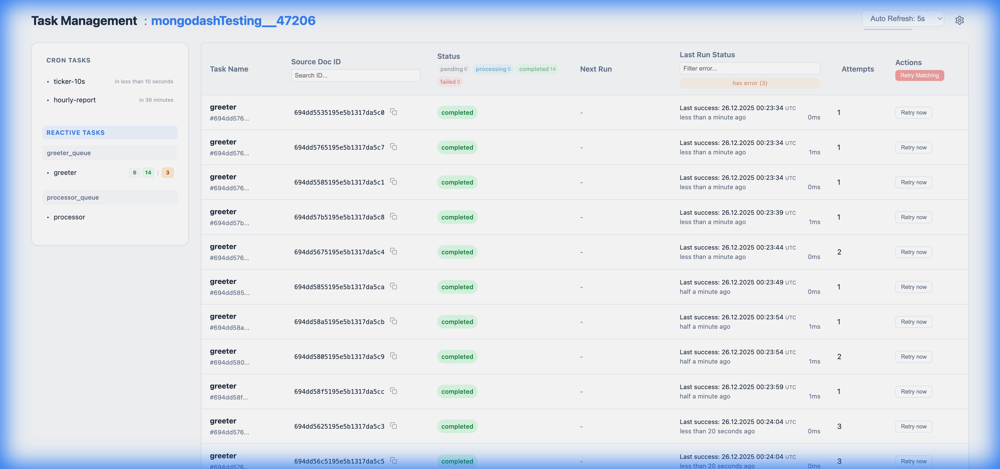

# Mongodash Dashboard

The Mongodash Dashboard is a built-in administration interface for monitoring and managing your Reactive and Cron tasks. It is framework-agnostic and can be easily integrated into your existing Node.js application (Express, Koa, Fastify, or plain `http`).

## Purpose

The dashboard provides a visual overview of your task system's health and operational state. It allows you to:
- **Monitor** the status of all reactive and cron tasks (pending, processing, completed, failed).
- **Debug** issues by viewing error messages and stack traces directly in the UI.
- **Retry** failed reactive tasks manually or in bulk based on filters.
- **Trigger** cron tasks immediately for testing or ad-hoc execution.
- **Analyze** performance by viewing execution history and last observed values (internal state is hidden by default).

## Look and Feel


The dashboard features a clean, responsive UI with two main sections:

### 1. Sidebar Navigation
- **Task Collections**: Quickly navigate between reactive tasks grouped by their source collection.
- **Live Stats**: See real-time counts of pending, processing, and failed tasks for each collection.
    - **Error Counts**: An orange badge indicates the total number of errors encountered by tasks in that group.
- **Cron Tasks**: View next run times for scheduled jobs directly in the sidebar.

### 2. Reactive Tasks View
Displays a paginated list of all reactive tasks.
- **Filters**: Filter tasks by Name, Status (e.g., `failed`, `pending`), Error Message, and **Source Document ID**.
    - **URL Sync**: All filters are automatically synchronized with the URL query parameters, making it easy to share specific views (e.g., "Show me all failed email tasks").
- **Source Doc ID Filter**: A smart search that accepts exact strings, ObjectIDs, or numbers to find tasks related to a specific source document.
- **Bulk Actions**:
    - **Retry Matching**: A button to retry all tasks that match the current filters.

### 3. Cron Tasks View
Displays a list of all registered cron tasks.
- **Status**: Shows the next scheduled run time (relative time) and the last execution status.
- **Actions**:
    - **Trigger Now**: A button to immediately execute a cron task, regardless of its schedule.

## Integration

You can mount the dashboard on any route in your application. The `serveDashboard` function handles both API requests and static asset serving.

### Express
```typescript
import * as express from 'express';
import { serveDashboard } from 'mongodash';

const app = express();

app.use('/dashboard', async (req, res, next) => {
    // Check if mongodash handled the request
    const handled = await serveDashboard(req, res);
    if (!handled) {
        next();
    }
});

app.listen(3000);
```

### Koa
```typescript
import * as Koa from 'koa';
import { serveDashboard } from 'mongodash';

const app = new Koa();

app.use(async (ctx, next) => {
    // Koa's ctx.req and ctx.res are the native Node.js objects
    // serveDashboard is mounted at root or check ctx.path manually if needed
    if (ctx.path.startsWith('/dashboard')) {
        const handled = await serveDashboard(ctx.req, ctx.res);
        if (handled) return;
    }
    await next();
});

app.listen(3000);
```

### Native HTTP
```typescript
import * as http from 'http';
import { serveDashboard } from 'mongodash';

const server = http.createServer(async (req, res) => {
    // Mount at /dashboard
    if (req.url?.startsWith('/dashboard')) {
        const handled = await serveDashboard(req, res);
        if (handled) return;
    }

    res.statusCode = 404;
    res.end('Not Found');
});

server.listen(3000);
```

## Manual Triggering & Retries

While the system is autonomous, manual intervention might sometimes be handy.

- **Reactive Tasks**: If tasks fail (e.g., due to a bug or temporary external outage), you can use the **Retry Matching** feature in the dashboard.
    1. Filter for the failed tasks (e.g., Status: `failed`, Error: `Timeout`).
    2. Click "**Retry now**".
    3. Confirm the action.
    - This will reschedule the tasks to `now` and reset their status to `pending`, allowing workers to pick them up immediately.
    - **History Preserved**: Unlike a full reset, this action **preserves** the task's error history (attempt count, first error timestamp) for auditing purposes. The attempts count will only be reset if the task subsequently succeeds or if the source document changes (depending on `resetRetriesOnDataChange` policy).

- **Cron Tasks**: You can force a cron task to run immediately via the **Trigger** button. This is helpful for testing cron logic without waiting for the schedule.

## Architecture Notes

### Read Preference
- **Sidebar Statistics**: By default, the dashboard fetches statistics (counts, Sidebar badges) using `secondaryPreferred` read preference to minimize load on the Primary node.
- **Task Lists**: The main task lists (table views) use the default read preference of your MongoDB connection (usually `primary`).
